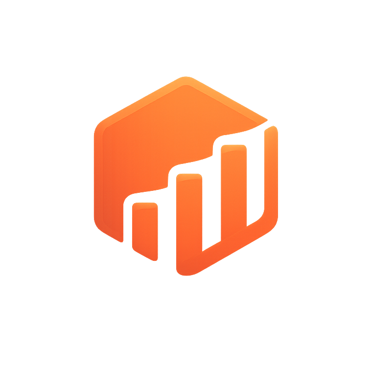

<p align="center">
  
</p>

<h1 align="center">claudget</h1>

<p align="center">
  <b>See your Claude Code usage on your desktop — live, local, and free.</b><br/>
  <sub>Plan limits · time-to-reset · tokens · cost · burn rate · budgets &amp; alerts — always on top, no API key.</sub>
</p>

<p align="center">
  <a href="https://github.com/manankapoor23/claudget/releases/latest"></a>
  <a href="https://github.com/manankapoor23/claudget/releases"></a>
  <a href="https://github.com/manankapoor23/claudget/actions/workflows/release.yml"></a>
  <a href="LICENSE"></a>
  <a href="https://github.com/manankapoor23/claudget/stargazers"></a>
  
</p>

<p align="center">
  <a href="#-download--install"><b>Download</b></a> ·
  <a href="https://claudget.vercel.app"><b>Website</b></a> ·
  <a href="#-what-it-does"><b>Features</b></a> ·
  <a href="#-contributing"><b>Contributing</b></a> ·
  <a href="#-how-it-works"><b>How it works</b></a>
</p>

<!--
  📹 DEMO GIF GOES HERE. Record a ~10s clip of the widget updating live, save it
  to docs/demo.gif, then uncomment the line below. This is the single highest-
  impact thing for the README — a moving picture of the widget sells it instantly.

  <p align="center"></p>
-->

---

No setup. claudget just reads what the Claude Code CLI already keeps on your machine — the OAuth token from the macOS Keychain (or `~/.claude/.credentials.json` elsewhere). Nothing to paste in, no key to generate. **If `claude` already works for you, this will too.**

I built it because I kept alt-tabbing to a terminal just to run a usage command and check whether I was about to hit my limit. Now it's just... there.

## Contents

- [What it does](#what-it-does)
- [Download &amp; install](#download--install)
- [Changelog](CHANGELOG.md)
- [Screenshots](#screenshots)
- [Configuration](#configuration)
- [Keyboard shortcuts](#keyboard-shortcuts)
- [How it works](#how-it-works)
- [Security &amp; privacy](#security--privacy)
- [Contributing](#contributing)
- [Building from source](#building-from-source)
- [Troubleshooting](#troubleshooting)
- [Project layout](#project-layout)
- [License](#license)

---

## What it does

- **Live usage %** for the 5-hour and weekly windows, with a countdown to reset — pulled straight from Anthropic's usage endpoint using the token Claude Code already stored. You do nothing. Switch it off in Settings to stay 100% local.
- **Works offline** for everything else — tokens, cost estimates, per-model breakdown, ~5h session blocks, burn rate, and an activity sparkline — all computed from your local transcripts.
- **Budgets &amp; alerts** — set a daily or monthly spend budget and get a native notification at 80% and 100%. Turns a passive dashboard into something that actually warns you.
- **Forecast, pace &amp; insights** — "at this rate" projected spend, an on-track / burning-fast badge vs your plan window, and a quick read on your top project, model split, and busiest hour.
- **Stays out of your way** — frameless, translucent, draggable, always-on-top (and it follows you across every macOS Space / over fullscreen apps). Compact mode when you just want the number; click-through when it's in the way; lives in the tray with global hotkeys.
- **Dark / light / system** theme.
- **Read-only &amp; private** — never writes to `~/.claude`, never logs your token, never phones home anywhere except `api.anthropic.com`. ([details](#security--privacy))

## Download &amp; install

Grab the latest build from the **[Releases page →](https://github.com/manankapoor23/claudget/releases/latest)**

**Which file do I download?** One per machine:

| Your OS | File | Notes |
| --- | --- | --- |
| **macOS** (Intel or Apple Silicon) | `claudget-<ver>-universal.dmg` | one file, both chips |
| **Windows** | `claudget-<ver>-Setup-x64.exe` | installer + auto-update |
| **Windows** (no install) | `claudget-<ver>-Portable-x64.exe` | single .exe, run anywhere |
| **Linux** | `claudget-<ver>.AppImage` | `chmod +x` then run |

> Ignore the `.blockmap` and `latest*.yml` files — those are for the auto-updater, the app fetches them itself.

### First launch — the "unverified" warning

I'm not paying Apple/Microsoft to sign an open-source side project, so your OS will complain the first time. **This is about the missing signature, not malware** ([here's how to verify that for yourself](#security--privacy)):

- **macOS** — modern macOS (Sequoia) hard-blocks unsigned apps and may move them straight to Trash. The reliable fix: drag **claudget** into Applications (restore from Trash first if needed), then run:
  ```bash
  xattr -dr com.apple.quarantine /Applications/claudget.app
  ```
  Then open it. (Or: **System Settings → Privacy &amp; Security → "claudget was blocked" → Open Anyway**.) To skip the block next time, strip quarantine from the download *before* opening it: `xattr -cr ~/Downloads/claudget-*.dmg`.
- **Windows** — SmartScreen → **More info** → **Run anyway**.
- **Linux** — no prompt; `chmod +x` and run.

Auto-update works on Windows/Linux. macOS being unsigned means no auto-update — grab new versions from Releases when you want them.

## Screenshots

There are three views — the full dashboard, compact mode, and settings.

<!--
  Add real images for max impact. Drop them in docs/ and reference here, e.g.:
  <p align="center">
    
    
    
  </p>
-->

_(Until screenshots land here, the fastest way to see it is [downloading a build](#download--install) or [running from source](#building-from-source).)_

## Configuration

Settings live in a JSON file in the app's user-data dir. Easiest way to edit: the in-app **Settings** screen. You can also open the raw file from **Settings → About → Config file**, or find it yourself:

| OS | Path |
| --- | --- |
| Windows | `%APPDATA%\claudget\config.json` |
| macOS | `~/Library/Application Support/claudget/config.json` |
| Linux | `~/.config/claudget/config.json` |

Hand-edit and mess up a field? That one field falls back to its default — a bad value never bricks the app. Full schema:

| Key | Type / range | Default | What it does |
| --- | --- | --- | --- |
| `enableOfficial` | boolean | `true` | poll Anthropic for the plan-limit gauges. `false` = fully local. |
| `dailyBudgetUSD` | number ≥ 0 \| null | `null` | daily spend budget; notifies at 80% &amp; 100%. `null` = off. |
| `monthlyBudgetUSD` | number ≥ 0 \| null | `null` | monthly spend budget; notifies at 80% &amp; 100%. `null` = off. |
| `officialPollIntervalMs` | int, 180000–3600000 | `300000` | how often to poll. **Floor is 180s** — the endpoint rate-limits. |
| `localDebounceMs` | int, 200–10000 | `1000` | debounce for transcript file-change events |
| `fullRescanIntervalMs` | int, 10000–3600000 | `120000` | periodic full rescan, catches new projects/missed FS events |
| `recentSessionLimit` | int, 1–100 | `8` | how many recent sessions to list |
| `historyWindowHours` | int, 1–168 | `24` | how far back the sparkline goes |
| `blockHours` | number, 1–24 | `5` | length of a usage "block" (Claude's window is ~5h) |
| `currency` | ISO 4217 | `"USD"` | display currency for costs |
| `claudeDir` | string \| null | `null` | override `~/.claude` location, `null` = auto-detect |
| `pricingOverridePath` | string \| null | `null` | point at your own pricing JSON instead of the bundled one |
| `theme` | `system`\|`dark`\|`light` | `"system"` | color theme |
| `alwaysOnTop` | boolean | `true` | keep window above everything |
| `clickThrough` | boolean | `false` | let clicks pass through to whatever's underneath |
| `compact` | boolean | `false` | minimal layout |
| `opacity` | number, 0.3–1 | `1` | window opacity |
| `showInTaskbar` | boolean | `true` | show in taskbar/dock |
| `launchOnLogin` | boolean | `false` | start at login |
| `logLevel` | `error`\|`warn`\|`info`\|`debug` | `"info"` | log verbosity |

**Env override:** `CLAUDE_CONFIG_DIR` sets the Claude data dir if you keep it somewhere nonstandard (the `claudeDir` config field wins if both are set).

## Keyboard shortcuts

| Shortcut | Action |
| --- | --- |
| `Ctrl/Cmd+Alt+U` | show / hide |
| `Ctrl/Cmd+Alt+C` | toggle click-through |

The tray icon has the same toggles plus Refresh, Open logs, Open config, and Quit.

## How it works

Two data sources, combined into one snapshot the UI renders:

1. **Local transcripts** — `~/.claude/projects/**/*.jsonl`, parsed and aggregated into token counts, cost estimates, a per-model breakdown, ~5h blocks, burn rate, and an hourly series. Ground truth for spend, fully offline.
2. **Official usage endpoint** — `api.anthropic.com/api/oauth/usage`, hit with the same OAuth token and `claude-code/<version>` user-agent the CLI uses. Ground truth for plan limits (% used, % left, reset time). Polled at most every 180s, with backoff on 429s.

If the endpoint is unreachable (offline, expired login, rate-limited), it shows the last known numbers tagged **Cached** and keeps local data flowing. Long version in [`docs/ARCHITECTURE.md`](docs/ARCHITECTURE.md).

## Security &amp; privacy

The whole point is that it's boring and trustworthy. It's also open source, so you don't have to take my word — you can check:

- **One network endpoint in the code:** `api.anthropic.com` (the official usage check). On Windows/Linux the auto-updater also checks **GitHub Releases**. That's it — no telemetry, no analytics, no other servers.
- **Your OAuth token** is read from the Keychain / credentials file and sent **only** to `api.anthropic.com`. It's never logged. Only non-secret fields (subscription type, rate-limit tier, scopes, org UUID) ever appear in snapshots/logs.
- **Strictly read-only** on `~/.claude` — it never writes there. App state (config, window position, logs) stays in the app's own user-data dir.
- **The binary matches the source:** every release is built by GitHub Actions from the tagged public commit, not hand-uploaded.

Want to verify yourself? Read the source, [build it](#building-from-source), or watch its traffic with Little Snitch / `lsof` — you'll see only `api.anthropic.com` (and GitHub on update checks). (Unsigned Electron apps sometimes trip 1–2 generic false positives on VirusTotal — that's the missing signature, not malware.)

## Contributing

Contributions are genuinely welcome — this is built in the open and PRs, issues, and ideas all help.

### Ways to help

- **Report a bug** — [open an issue](https://github.com/manankapoor23/claudget/issues/new) with your OS, what you did, and what happened (logs help: **Settings → Logs**, or set `logLevel: "debug"`).
- **Suggest a feature** — open an issue and describe the use case.
- **Test on your platform** — Windows and Linux especially need real-world eyes on tray + always-on-top behavior.
- **Improve docs** — typos, unclear steps, missing screenshots.
- **Send a PR** — see below.

### Good first contributions

A few things on the wishlist that are well-scoped to pick up:

- Menu-bar mini mode (live number in the macOS menu bar)
- CSV export of usage history
- A first-run onboarding screen
- Windows/Linux parity polish for the tray + window behavior

### Dev setup

```bash
git clone https://github.com/manankapoor23/claudget.git
cd claudget
npm install          # installs both workspaces
npm run dev          # hot-reloading renderer + main
```

Architecture overview lives in [`docs/ARCHITECTURE.md`](docs/ARCHITECTURE.md) and the layout is in [Project layout](#project-layout). The data layer (`packages/core`) is framework-agnostic and unit-tested; the Electron + React app is `packages/desktop`.

### Before you open a PR

Run the full check suite from the repo root — CI will run these too, so green locally = green PR:

```bash
npm run typecheck     # strict tsc, both workspaces
npm test              # vitest (core)
npm run lint          # eslint
npm run format:check  # prettier
```

Then:

1. **Branch** off `main` with a descriptive name (`fix/tray-linux`, `feat/csv-export`).
2. **Keep it focused** — one logical change per PR. Match the surrounding code style.
3. **Add a test** if you touch non-trivial logic in `core` (it's vitest, no ceremony).
4. **Write a clear PR description** — what changed and *why*; link the issue; add a screenshot/GIF for any UI change.
5. Be kind in reviews and issues. That's the whole code of conduct.

> Working against Electron/React/Vite/Zod/Vitest/tsup/chokidar APIs? Check the current docs — these shift between versions.

## Building from source

Requires Node ≥ 20, npm ≥ 9, and the Claude Code CLI installed and logged in (run `claude` once if you haven't). Works on macOS, Windows, Linux.

```bash
npm install
npm run dev            # dev mode, hot reload

npm run build          # build core (tsup) + desktop (electron-vite)
npm start              # run the built bundle
```

Run the built app without packaging an installer:

```bash
npm run build
npx electron packages/desktop
```

**Scripts** (all from the repo root):

| Script | Does what |
| --- | --- |
| `npm run dev` | builds `core`, launches the app with hot reload |
| `npm run build` | builds `core` (tsup) + desktop (electron-vite) |
| `npm run package` | full build → installer via electron-builder |
| `npm run package:dir` | unpacked app dir, no installer — fast for testing |
| `npm run typecheck` | strict `tsc --noEmit`, both workspaces |
| `npm test` | vitest (`core` only) |
| `npm run lint` | eslint, whole repo |
| `npm run format` | prettier write (`format:check` to verify) |

**Packaging** ([`packages/desktop/electron-builder.yml`](packages/desktop/electron-builder.yml)) targets Windows NSIS + portable, macOS universal dmg, and Linux AppImage; output lands in `packages/desktop/release`. Releases are cut by pushing a tag (`npm version patch && git push --follow-tags`), which triggers the GitHub Actions workflow to build all three OSes.

> **Windows gotcha:** electron-builder pulls a `winCodeSign` bundle containing macOS symlinks; extracting it can fail with "A required privilege is not held by the client" unless Developer Mode is on (Settings → System → For developers) or you run from an elevated shell. The macOS bits don't matter for a Windows build.

## Troubleshooting

- **"No usage data is available yet."** — You haven't used Claude Code on this machine yet, or `~/.claude/projects` is empty. Run a session and give it a second.
- **Plan limits stuck on "Sign in…" / "login expired".** — Run `claude` once to refresh credentials; the widget picks it up on the next poll.
- **Plan limits showing "Cached" / rate-limited.** — Anthropic is throttling the usage endpoint (expected if you poll a lot). It backs off on its own; local data is unaffected. Raise `officialPollIntervalMs` if it persists.
- **Cost numbers look off.** — They're estimates from a bundled price table, not official. Point `pricingOverridePath` at your own JSON for accuracy. (Plan-limit percentages come straight from Anthropic and are exact.)
- **"Electron failed to install correctly."** — The Electron binary download got interrupted. Run `node node_modules/electron/install.js`, or delete `node_modules` and `npm install` again.
- **Logs** — tray menu or **Settings → Logs**. Set `logLevel: "debug"` for more.

## Project layout

```
packages/
  core/        framework-agnostic data layer — parsing, aggregation, the official
               client, the engine. No Electron, no React. vitest for tests.
  desktop/     the Electron app — main process (windowing, tray, IPC, config),
               preload bridge, and the React renderer for the UI.
docs/
  ARCHITECTURE.md   how it's all wired together, the long version.
website/       the marketing site (Next.js) → claudget.vercel.app
```

## License

MIT — see [LICENSE](LICENSE). Do what you like with it.

---

<p align="center">
  <sub>Built by <a href="https://github.com/manankapoor23">Manan Kapoor</a>. Not affiliated with Anthropic — claudget only reads what Claude Code already stores on your machine.</sub><br/>
  <sub>If it's useful, a star on the repo genuinely helps it reach other people.</sub>
</p>
